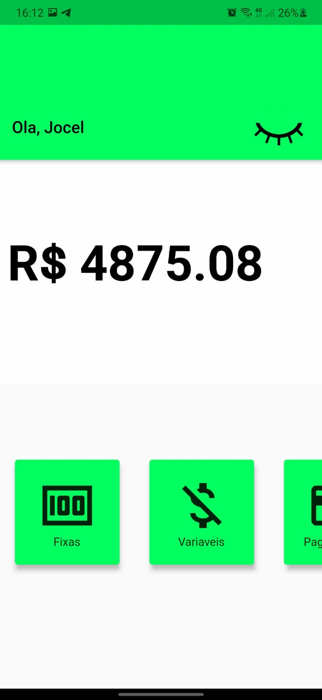

# Gastos Mensais

Projeto com o objetivo de estudar clean architecture.

## Descrição

Projeto CRUD para adicionar contas fixas e contas variaveis no mes, com visualização do saldo devedor do mes vigente.

 
  
  

## Desenvolvimento 
- [x] Dashboard.
- [ ] Modulo Contas Fixas.
- [ ] Modulo Contas Variaveis.
- [ ] Pagamentos
- [ ] Testes Unitários - TDD

## Recursos
- Flutter_modular
- Sqflite
- Clean Architecture
- FutureBuilder<>
- SetState()
- Navegação com o modular
  

## Considerações
- Praticar e compreender melhor o Clean Architecture, até por isso separei o databse em um modulo e apliquei a arquitetura.
- Praticar SQL com a utilização do Sqflite.
- Não foi utilizado gerencia de estado, pois nao era o objetivo.
  

A few resources to get you started if this is your first Flutter project:

- [Lab: Write your first Flutter app](https://flutter.dev/docs/get-started/codelab)
- [Cookbook: Useful Flutter samples](https://flutter.dev/docs/cookbook)

For help getting started with Flutter, view our
[online documentation](https://flutter.dev/docs), which offers tutorials,
samples, guidance on mobile development, and a full API reference.
